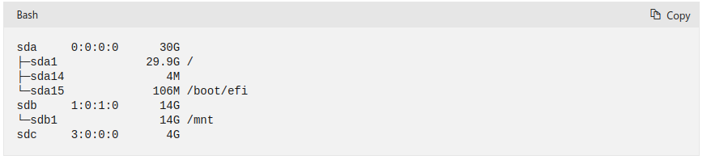

# Setting up an EC2 instance with BenchBase

### Step 1: Create a cloud instance 
We recommend creating an m5d.xlarge instance on AWS EC2 or a Standard_D4s_v3 instance with an added SSD on Microsoft Azure, or a corresponding instance with a different cloud provider. Use ubuntu 20.04, since this is the operating system our setup script is written for. 

### Step 2: Clone our synthetic workload repo on your cloud instance 
`git clone https://github.com/dbtuneai/synthetic_workload.git` 

### Step 3: Add the name of the disk you want the database on as an environment variable, so that the setup script can mount that disk to a folder. 
On a type-d instance on AWS EC2 such as m5d.xlarge this will be nvme1n1. Run: 
`export VAR=nvme1n1` 
On Microsoft Azure you can run the command:  
`lsblk -o NAME,HCTL,SIZE,MOUNTPOINT | grep -i "sd"` 
and from the output see the name of the unmounted disk, i.e., sdc in this screenshot:  
 
Run the command:  
`export VAR={name_of_disk}` 

### Step 4: Run the setup.sh script from the synthetic_workload folder 
`cd synthetic_workload & source setup.sh` 
This script automates the following steps: 
- Mounts the specified disk to a directory.
- Installs relevant packages for the benchmark.
- Installs PostgreSQL 14.
- Installs the BenchBase benchmarking suite.
- Moves the loader script, the runner script and the pre-configured config files into the BenchBase folder.
- Copies the PostgreSQL data directory to the mounted directory and configures the PostgreSQL parameter data_directory accordingly.
- Configures the Postgres parameter max_connections.
- Creates a PostgreSQL user. 

### Step 5: Use terminal multiplexer for data loading and running the workload 
This command will be useful if you want to disconnect while the benchmark is running and the tuning is being performed. 
`screen` 
Here are some helpful terminal multiplexer commands: 
`screen -ls (to list all the screens)` 
`screen -r {id} (to attach the screen)` 
`ctrl-a + ctrl-d (to detach the screen)` 

### Step 6: Edit the BenchBase config file for the benchmark you want to run 
`nano benchbase-postgres/config/postgres/sample_{benchmark}_config.xml` 

We recommend using one of the following benchmarks:
- epinions,
- chbenchmark,
- resourcestresser. 
We have pre-configured the config files for these benchmarks. If you are using a different EC2 instance than m5d.xlarge you must configure the parameter scalefactor accordingly so that the database is significantly larger (e.g., at least 2x larger) than the available RAM memory. Unchanged, these config files will generate a 40 or 80 GB database (80 GB for Epinions), which will work well with m5d.xlarge. The total database size scales linearly with scalefactor.  

Guidelines for choosing the benchmark setting and for deciding the tuning target, as well as comments on all the available benchmarks in BenchBase can be found in our synthetic workload guide.

### Step 7: Load synthetic data to the database 
Run the following command from the benchbase-postgres folder, which was created when you ran the setup.sh script. On m5d.xlarge with our pre-configured settings epinions takes ~28 hours to load, chbenchmark ~80 minutes and resourcestresser ~30 minutes. 

`cd benchbase-postgres` 
`python loader.py --benchmark {benchmark}` 

### Step 8: Run the synthetic workload 
Run the following command from the benchbase-postgres folder:  
`python runner.py --benchmark {benchmark}` 

### Step 9: Detach the terminal after starting the workload 
`press Ctrl-a + Ctrl-d` 

### Step 10: Workload warmup 
Let the benchmark run for at least 5 minutes before starting the tuning session so that the workload stabilizes. Let it run for 60 minutes if you are running resourcestresser.  

# Start the tuning session with DBtune
Log in on your account at https://app.dbtune.ai/. Follow the instructions in the DBtune user guide at the top left of the screen to set up and start a tuning session. 
